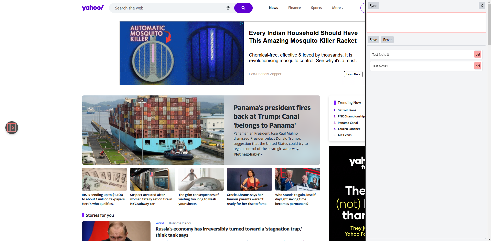
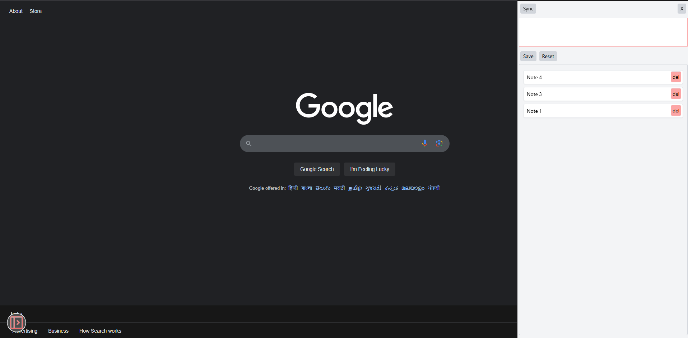
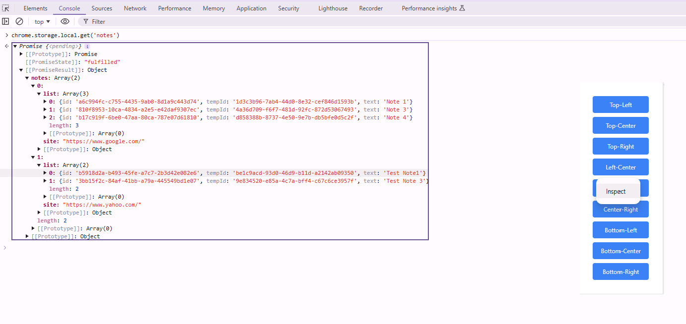

## This is a sample chrome extension using Typescript, React, Tailwind CSS, and webpack for the blog post that is at the following location: [Blog](https://medium.com/@nadkarnigaurav/chrome-extension-development-develop-minimal-app-with-typescript-react-tailwind-css-and-webpack-52c9d82d4d25)


To generate the build run
```npm run build```

#### Screeshots are as follows








